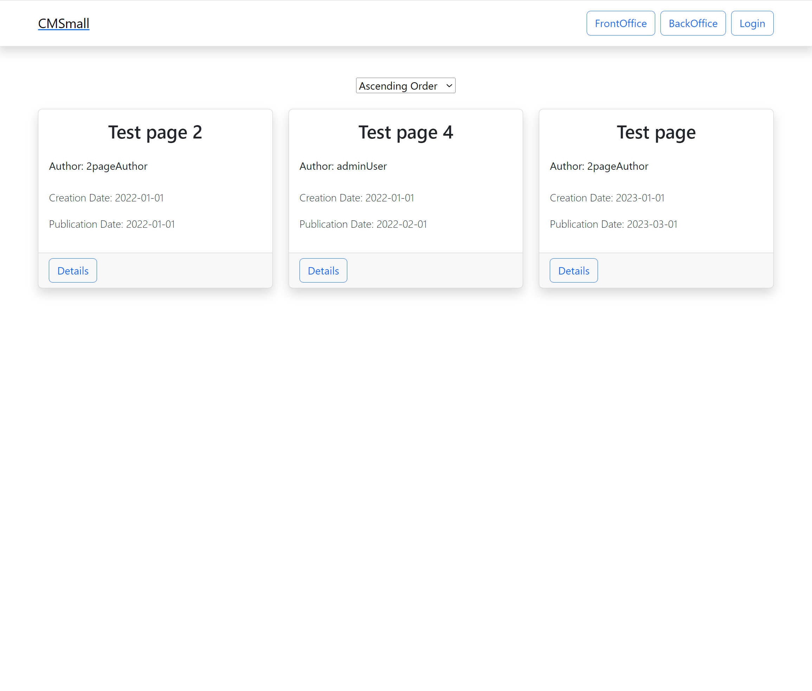
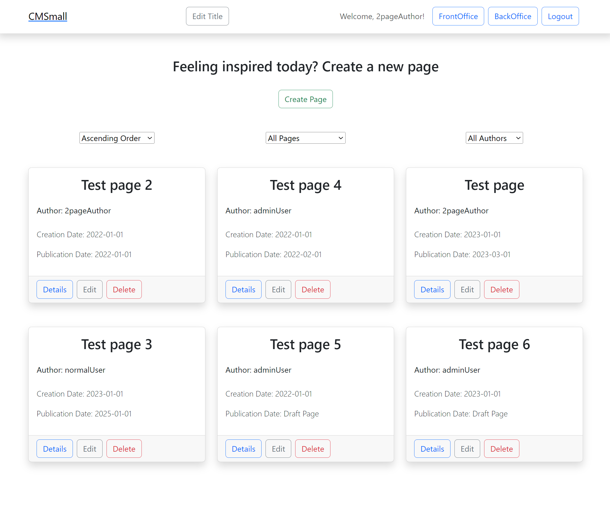
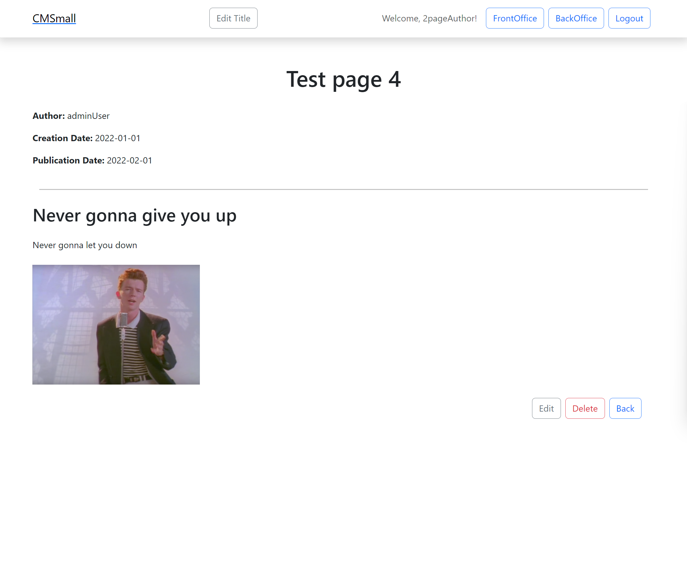
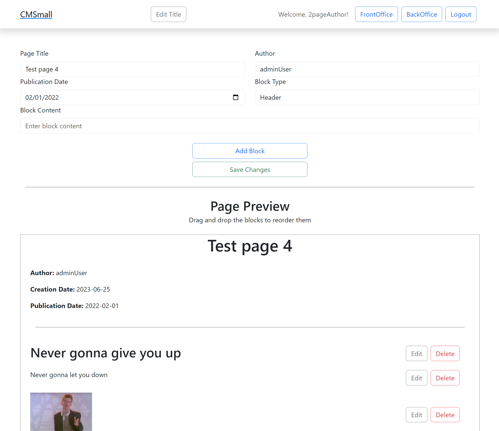

# Exam #1: "CMSmall"
## Student: s317002 GIAMBRONE SIMONE 

## React Client Application Routes

- Route `/`: FrontOffice page
- Route `/backoffice`: BackOffice page
- Route `/login`: Login Page
- Route `/pages/:id`: Page that shows details about a single page, `:id` is the Page ID
- Route `/pages/create`: Page that lets any authenticated user create a page
- Route `/pages/edit/:id`: Page that lets a user edit a page, `:id` is the Page ID

## API Server
### Authentication
- POST `/api/login`
  - Request body : `{username: "emailToLogin", password:"passwordToLogin"}`
  - Response body : `{
          id: user.id,
          email: user.email,
          username: user.username,
          role: user.role
        }`
- GET `/api/session`:
  -  Response body :
    -  If the request is authenticated: `{
          id: user.id,
          email: user.email,
          username: user.username,
          role: user.role
        }`
    -  If the request is not authenticated: `{ error: "Unauthenticated user!" }`    
- DELETE `/api/logout`: Performs logout
  
### Pages

-  GET `/api/pages/all`: Needs authentication and returns an array with all the pages in the DB
-  GET `/api/pages/all/published`: Doesn't need authentication and returns an array with all the pages created earlier than today or today in the DB.
-  GET `/api/pages/:id`: Needs authentication and returns the page with `id == :id`
-  GET `/api/authors/all`: Needs authentication and returns an array with all the possible authors(All the saved users) in the DB
-  POST `/api/pages/create`: Needs authentication, lets an authenticated user create a new page. Returns the id of the created page
-  DELETE `/api/pages/:id`: Needs authentication, deletes the page with `id == :id`
-  PUT `/api/pages/:id`: Needs authentication, updates the page with `id == :id`

### Other
- GET `/api/title`: Doesn't need authentication, returns the website title saved in the DB
- PUT `/api/title`: Needs admin privileges, updates the website title in the DB
- GET `/api/images/all`: Doesn't need authentication, returns the names of the static images saved in `/public/images`

## Database Tables

- Table `users`: `(id, email, username, salt, password, role)`
- Table `pages`: `(id, title, author, creation_date, publication_date)`
- Table `blocks`: `(id, page_id, type, content, position)`
- Table `site`: `(id, title)`

## Main React Components

- `HeaderComponent.jsx`: Header that is present on every page of the site, contains the website title, the button to update it, the buttons to navigate to FrontOffice and BackOffice, the Login/Logout button and the a greeting message for the logged in user.
- `LoginForm.jsx` : Login form that is rendered in the `LoginPage` page, handles the login logic, sets the user and redirects to `"/"` upon successful login.
- `PageComponent.jsx` : Component that renders all the properties of a page, displayed on the `SinglePage` page.
- `PageCreationForm.jsx`: Form that handles all the logic necessary to create a page, displayed on the `CreationPage` page.
- `PageEditForm.jsx`: Form that handles all the logic necessary to edit a page, displayed on the `EditPage` page. Similar to `PageCreationForm`
- `PageGrid.jsx`: Component that renders a grid of pages, used in the `FrontOffice` and `BackOffice` pages to display all the pages informations. Also contains filtering logic based on the publication date of a page and on its author.
- `SinglePageButtons.jsx`: Component that renders the `Edit` and `Delete` buttons on the `SinglePage` page.
- `StrictModeDroppable.jsx`: Component that makes the `Droppable` import usable with `React.StrictMode` enabled.

## Screenshots

### Front Office while unauthenticated

### Back Office view as admin

### Single Page view as admin/page author

### Edit Page view as Admin

## Users Credentials

- 2pageAuthor => `(2page@test.it , test)`
- 0pageAuthor => `(0page@test.it , test)`
- normalUser => `(user@test.it, test)`
- adminUser => `(admin@test.it, test)`

